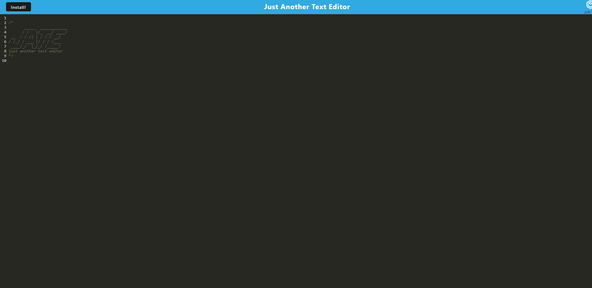

# Text editor

  (https://img.shields.io/badge/license-mit-brightgreen.svg)

  ## Table of contents

  * [Description](#Description)

  * [Installation](#Install)

  * [Usage](#Use)

  * [Questions](#Questions)

  * [Contributors](#Contributors)
  
  * [Testing](#Testing)
  
* [license](#license)

  
  ## Description
  just a simple text editor
 
  ## Installation 
  click the install button in the browser window or download the code from github and run npm i in both the client and server folders
  
  ## Usage
  in the browser you're able to edit simple text editor. It works similar to a notepad. The user can download the application.

  https://booopyhij-text-editor-b65690ded147.herokuapp.com/

 
  ## Questions
    
  Please reach out if you have any questions regarding this application. 

  * Name - mike
  * Email - 
  * GitHub - [booopyhij](https://github.com/booopyhij/)
  
  If you notice a bug with this application, please create an issue in github.
  Please provide specific details on how to recreate the bug, and possible suggestions
  on how to fix the bug. Please be as detailed as possible so I can fix it.
  
  ## Contributors
  Sam cordova, osu bootcamp miniproject,other projects I have worked on

  ## Testing
  na

  ## License: Licensed under mit License

